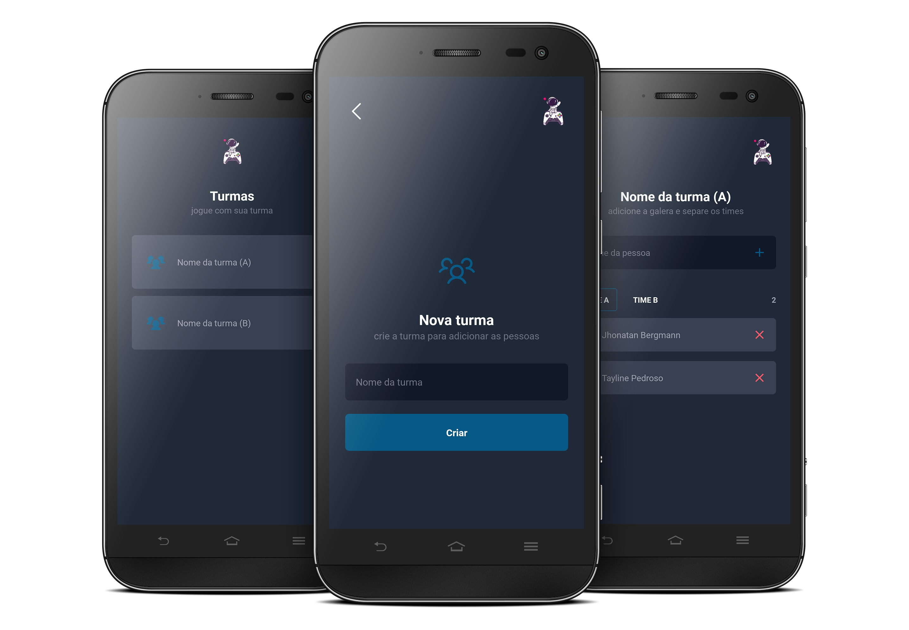

<h3 align="center">
  team-app
</h3>

  
  

To play with your group, create groups and assemble your teams.

  

## 📦 Tech Stack

- Expo
- Typescript
- Styled Components
- Async Storage

[check in package.json](package.json)

## 🔩 Installation

To install and run the project locally, follow these steps:

1. Install [**Yarn**](https://yarnpkg.com/) on your computer
1. Clone the repository `git clone https://github.com/jhonbergmann/team-app.git`
1. Navigate to the project directory: `cd team-app`
1. Install the dependencies: `yarn install`

## ⚙️ Usage

1. Start the development server: `yarn dev`
1. Read the QR Code with the Expo Go app

## 📝 License

[MIT © Jhonatan Bergmann](https://github.com/jhonbergmann/team-app/blob/main/LICENSE)
